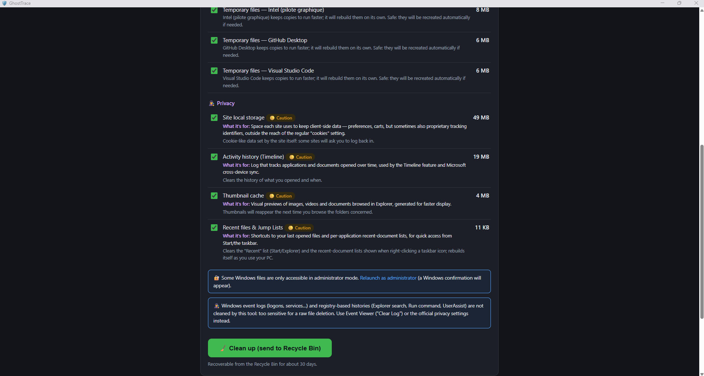
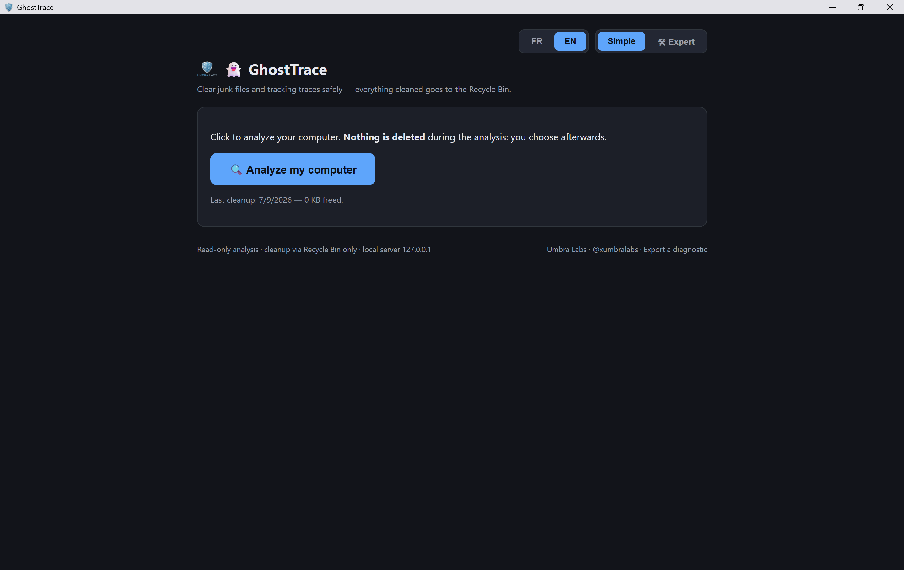
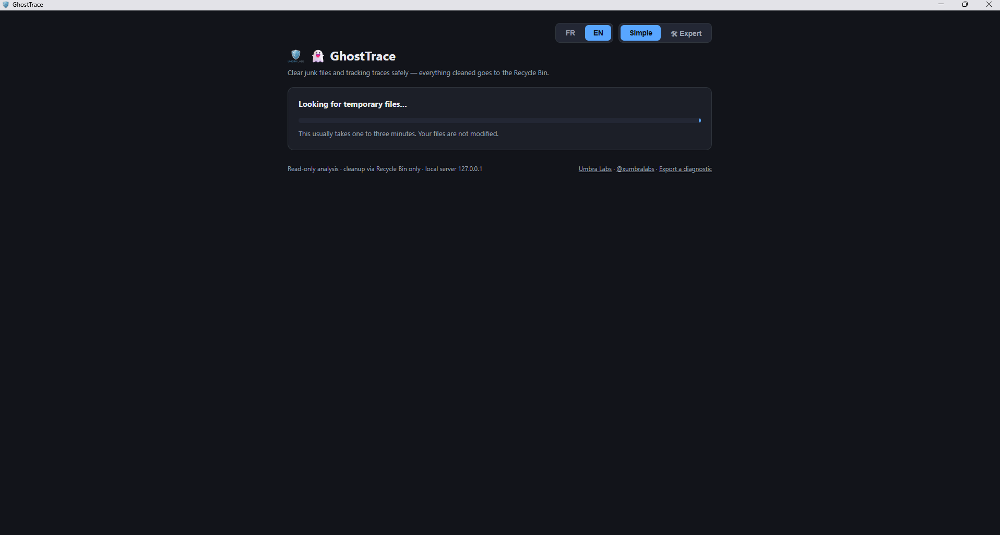
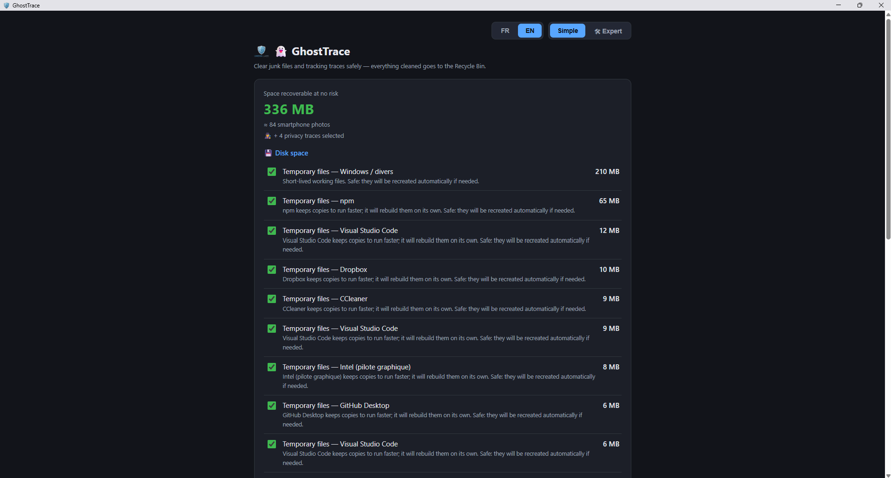
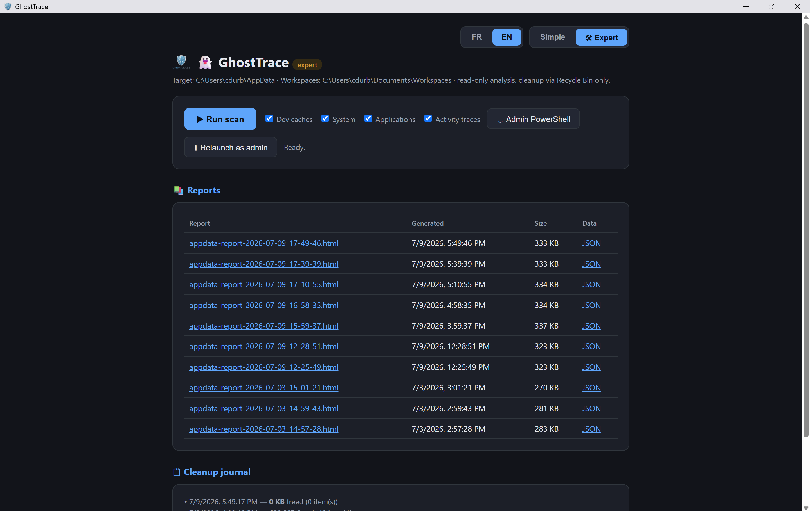
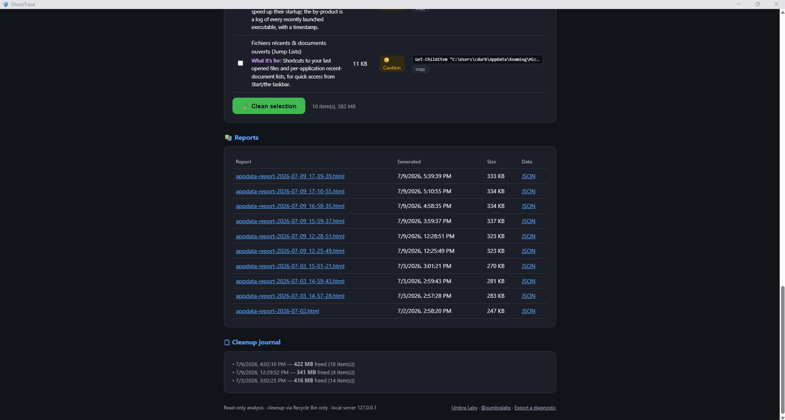
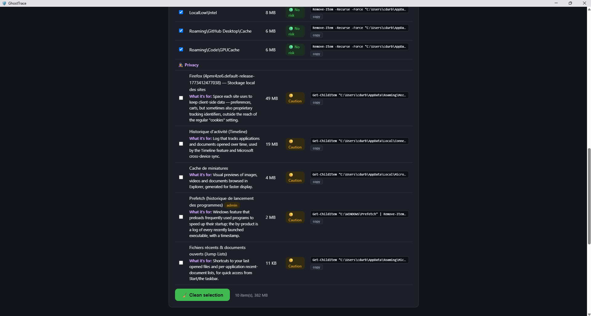
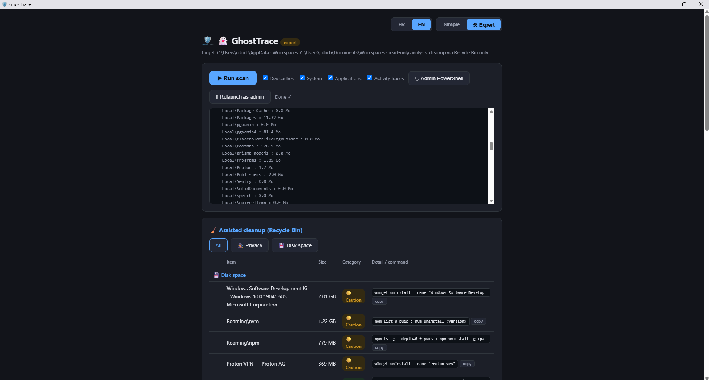

<p align="center">
  <a href="https://www.academy.umbra-labs.dev/"></a>
</p>

# 👻 GhostTrace



> See exactly what tracks you on Windows — cookies, browsing history, Prefetch, activity timeline — and clear gigabytes of ordinary junk alongside it, **without ever risking your data**. Read-only analysis, cleanup through the Recycle Bin only, 100% local, open source.

**🌍 Languages:** English (this file) · [Français](README.fr.md) — the app itself is bilingual (FR/EN, auto-detected, switchable).

[](../../releases/latest)
[](LICENSE)


An [Umbra Labs](https://www.academy.umbra-labs.dev/) tool — [@xumbralabs](https://x.com/xumbralabs)

---

## Why this tool?

Classic disk cleaners are black boxes: you don't know what they delete, why, or what they phone home. This one takes the opposite stance:

- 🔍 **Transparent** — every suggested item is explained: which application owns it, why it's removable, what happens afterwards. The code is open — read it.
- 🕵️ **Privacy-aware** — cookies, browsing history, saved sessions, Prefetch, Windows Timeline and more are detected across Chrome, Edge and Firefox, each explained in plain language: what it's actually *for*, not just whether it's "safe" to delete.
- ♻️ **Reversible** — everything cleaned goes to the **Recycle Bin** (recoverable for ~30 days). Never a permanent delete.
- 🔒 **Local** — no outbound network connection, no telemetry, no account. The built-in web server only listens on `127.0.0.1`.
- 🧠 **Cautious by design** — an unknown folder is **never** classified "safe to delete". Profiles, passwords, wallets and user data are detected and untouchable.
- 📦 **Zero dependencies** — standard Node.js only. No `node_modules`, no supply chain to audit.

## Comparison

How GhostTrace stacks up against the two disk cleaners most Windows users have already tried:

| | GhostTrace | CCleaner | BleachBit |
|---|---|---|---|
| Outbound network call | ❌ None — verifiable in the code ([`src/scanner.ts`](src/scanner.ts), [`src/cleaner.ts`](src/cleaner.ts)), zero dependencies | ✅ Yes — automatic update checks; this is the exact channel that was compromised in the 2017 supply-chain attack (see below) | ⚠️ No telemetry reported by independent reviews; closed-box on network behavior, not independently audited here |
| Explains each item found | ✅ Plain-language purpose for every cookie/cache/trace, not just "safe to delete" | ❌ Category checkboxes, no per-item explanation | ❌ Category checkboxes, no per-item explanation |
| Reversible cleanup | ✅ Recycle Bin only, always — enforced in [`src/cleaner.ts`](src/cleaner.ts) | ⚠️ Closed source — default behavior not independently verifiable from outside; a separate "secure deletion" option additionally overwrites data | ❌ Bypasses the Recycle Bin by design (built to prevent recovery, not to be undoable) |
| Open source | ✅ MIT, full source on GitHub | ❌ Proprietary | ✅ GPLv3 |
| Price | Free | Freemium — free tier + paid Pro subscription | Free |
| Multi-browser detection | ✅ Chrome, Edge, Firefox | ✅ Yes | ✅ Yes |

> **Why this matters:** in August 2017, an official CCleaner update (v5.33.6162) was compromised at the source — attackers had been inside Piriform's build network since March 2017 and modified the installer before it shipped from Piriform's own servers. An estimated **2.27 million users** downloaded it before Avast (Piriform's owner) caught it a month later. That's not a reason to distrust CCleaner specifically today — it's a reason to prefer tools where "trust us" isn't the only option available. GhostTrace is open source and makes zero outbound network calls precisely so that claim doesn't have to be taken on faith. Sources: [TechCrunch, Sept. 2017](https://techcrunch.com/2017/09/18/avast-reckons-ccleaner-malware-infected-2-27m-users/) · [Avast official post-mortem](https://blog.avast.com/update-ccleaner-attackers-entered-via-teamviewer).

## 🕵️ Privacy traces, explained — not just deleted

Most cleaners either ignore browsing/activity traces entirely, or wipe them blindly. GhostTrace does neither:

- **Detects them specifically** — cookies, browsing/search history, saved sessions, site storage, favicons and top sites for **Chrome, Edge and Firefox**; plus Windows-level traces: **Prefetch** (a log of every program you've recently run), **Recent files & Jump Lists**, the **thumbnail cache**, **Windows Timeline/Activity History**, and **clipboard history**.
- **Explains what each file is actually for**, before you decide anything — e.g. *"A site sets this cookie to recognize you across visits — staying logged in, remembering a cart — but also, very often, to track your browsing for advertising purposes."* The goal is understanding, not just a delete button.
- **Draws a hard line on what it will never touch**: saved passwords, saved payment/autofill data, and Firefox's `places.sqlite` (which mixes browsing history with your bookmarks in a single file) are shown for your information but **never** offered for deletion — that's not tracking, it's data you'd actually miss.
- **Warns you about consequences that matter** — clearing cookies logs you out everywhere; a running browser means its files are locked — instead of a generic "done" message.
- **Kept visually distinct from disk-space cleanup** in both modes — 💾 *Disk space* and 🕵️ *Privacy* are always shown as two separate groups, so you always know which kind of cleanup you're doing.

Everything above still goes through the same Recycle Bin safety net as disk-space cleanup: reversible for ~30 days, nothing permanent.

## Two modes, two audiences

**Simple mode** (default) — for everyone: one "Analyze my computer" button, plain-language explanations, split into two clearly labeled groups (💾 *Disk space* / 🕵️ *Privacy*), and only items **certified safe** by the rule base are offered. Explanation screens on first launch.

**Expert mode** (selector at the top right) — for technical users: the same 💾/🕵️ split plus a quick filter, full detail per folder (AppData levels 1-2, developer caches, system areas, unused applications), 🟢/🟡/🔴 categories, ready-to-copy PowerShell commands, archivable HTML/JSON reports, scan-over-scan evolution tracking, relaunch as admin.

## Screenshots

<table>
<tr><td align="center" colspan="2"><strong>Simple mode</strong></td></tr>
<tr>
<td width="50%"><br><sub>Ready to scan</sub></td>
<td width="50%"><br><sub>Scan in progress</sub></td>
</tr>
<tr>
<td width="50%"><br><sub>Privacy traces, explained</sub></td>
<td width="50%"><br><sub>Disk items, explained</sub></td>
</tr>
<tr><td align="center" colspan="2"><strong>Expert mode</strong></td></tr>
<tr>
<td width="50%"><br><sub>Dashboard &amp; report history</sub></td>
<td width="50%"><br><sub>Cleanup journal</sub></td>
</tr>
<tr>
<td width="50%"><br><sub>Privacy traces, explained</sub></td>
<td width="50%"><br><sub>Disk items, explained</sub></td>
</tr>
</table>

## Features

- **Privacy traces** across Chrome/Edge/Firefox and Windows itself (cookies, history, Prefetch, Jump Lists, Timeline…), each explained — see above
- **AppData** analysis (Local, LocalLow, Roaming) classified by a base of ~60 rules + cautious heuristics
- **MSIX mirror** detection (same physical content counted twice) through NTFS inode comparison
- **Developer caches**: orphaned `node_modules`, Gradle/Maven/NuGet/pip/Expo caches, Android emulator images, WSL/Docker virtual disks (with the compaction procedure)
- **System areas**: Windows Update leftovers, recycle bin, crash dumps, `hiberfil.sys`, restore points (admin)
- **Unused applications**: registry inventory cross-checked with execution traces (UserAssist, Prefetch) — uninstall advice, never automatic action
- **Tracking over time**: every scan is recorded; the report shows what grew since the previous one
- **Cleanup journal** with an "Open Recycle Bin" button
- **Bilingual UI** (English/French) — auto-detected from the browser, switchable at the top right

## Installation

### Option 1 — Executable (recommended)

Download `ghosttrace-vX.Y.Z.exe` from the [latest release](../../releases/latest), then **double-click**: the interface opens in an app window (the local server starts in the background and stops on its own after you close the window).

Each release is **built from source by the public GitHub Actions pipeline** ([.github/workflows/release.yml](.github/workflows/release.yml)) — the build logs are auditable. Verify your download against the published `SHA256SUMS.txt`:

```powershell
Get-FileHash .\ghosttrace-v2.1.0.exe -Algorithm SHA256
```

> ⚠️ **SmartScreen**: the executable is not code-signed (signing costs ~€300/year). Windows will show "unrecognized app" on first launch → "More info" → "Run anyway". That's exactly why the code is open source and the builds are reproducible: audit it, or build the exe yourself (option 2).

### Option 2 — From source

Prerequisite: [Node.js](https://nodejs.org/) ≥ 22.18 (native TypeScript execution). No dependencies to install.

```powershell
git clone https://github.com/umbralabsaccademy-droid/ghosttrace.git
cd ghosttrace

npm run serve        # web dashboard → http://localhost:7113
npm run scan:open    # or: console scan + HTML report
npm run build:exe    # build your own exe (dist\ghosttrace.exe)
```

`build:exe` uses Node SEA (Single Executable Application): `esbuild` bundles the sources, `postject` injects the result into a copy of `node.exe` — both tools are invoked one-shot via `npx`, nothing is added to the project.

### Command-line options

```
ghosttrace [--serve] [--port 7113] [--open] [--auto-exit]
           [--path <AppData>] [--out <folder>] [--workspaces <folder>]
           [--skip dev,system,apps,privacy,history] [--concurrency 32]
```

Run as **administrator** to also measure the full recycle bin, Windows areas, restore points and Prefetch (a "Relaunch as admin" button also exists in the UI).

## The safety contract

This is the part that matters. The tool commits to four guarantees, verifiable in the code:

| Guarantee | Where it's enforced |
|---|---|
| The **analysis** never modifies anything (read-only) | [src/scanner.ts](src/scanner.ts) — `readdir`/`stat` only |
| **Cleanup** goes exclusively through the Recycle Bin | [src/cleaner.ts](src/cleaner.ts) — .NET `SendToRecycleBin` API |
| The server can only delete items **identified by the last scan** (never an arbitrary path sent by a client) | [src/server.ts](src/server.ts) — id validation |
| An **unknown** folder is never "no risk"; Simple mode requires an exact rule | [src/knowledge.ts](src/knowledge.ts) + [src/actionables.ts](src/actionables.ts) |

On top of that: server bound to `127.0.0.1`, action endpoints protected against CSRF (custom header → CORS preflight), strict validation of served file names (no path traversal).

## Architecture

```
src/
├── cli.ts          Entry point: double-click → hidden server + app window; console; --serve
├── pipeline.ts     Full-scan orchestration, progress events
├── scanner.ts      Async disk walk (concurrent pool, junctions skipped, access errors tolerated)
├── knowledge.ts    ⭐ 🟢/🟡/🔴 classification rule base (~60 rules + heuristics, FR/EN texts)
├── dedupe.ts       MSIX mirror detection through NTFS inodes
├── devcaches.ts    Developer caches module
├── system.ts       System areas module (admin elevation detection)
├── apps.ts         Installed applications module (registry + UserAssist + Prefetch)
├── privacy.ts      🕵️ Privacy/activity-traces module (cookies, history, Prefetch, Timeline… across Chrome/Edge/Firefox)
├── history.ts      Scan history (append-only JSONL) and evolution computation
├── actionables.ts  Cleanable items + simple-mode guardrails + plain-language labels (FR/EN)
├── cleaner.ts      Recycle Bin cleanup (sequential, verified results)
├── report.ts       Analysis + self-contained bilingual HTML report
├── server.ts       Web dashboard (native http, SSE, simple/expert dual UI, FR/EN)
└── types.ts        Shared types
```

## Contributing

The most useful contribution: **extending the rule base** ([src/knowledge.ts](src/knowledge.ts)). You know an AppData folder that isn't listed? Add an entry to `EXACT_RULES` keyed by lowercase `root\name`:

```ts
'roaming\\myapp': (p) => ({
  category: GREEN,                      // green | yellow | red
  app: 'MyApp', dataType: 'cache', dataTypeEn: 'cache',
  note: 'Conséquence exacte de la suppression.',   // French
  noteEn: 'Exact consequence of deleting it.',     // English
  autoRecreated: true,                  // recreated automatically?
  command: rmCmd(p),                    // only if it's a pure deletion
}),
```

Golden rules of the project: an unknown is never 🟢, user data (profiles, wallets, credentials) is always 🔴, and when in doubt choose 🟡 with the consequence spelled out. Please provide both French and English texts.

Found a tracking file we're missing (another browser, a new Windows feature)? [src/privacy.ts](src/privacy.ts) is the module to extend — each entry needs a plain-language `purpose`/`purposeEn` (what it's for) in addition to the usual `note`/`noteEn` (what happens if you delete it).

Issues and pull requests welcome. No external dependencies — that's a principle, not an oversight.

## FAQ

**Does this replace clearing cookies/history from my browser's own settings?** Not exactly — think of it as a second pass: it also catches what browsers don't give you a one-click button for (Prefetch, Windows Timeline, Jump Lists, thumbnail cache…), across all your browsers at once, and explains what each item actually does before you clear it.

**Why is the exe 83 MB?** It embeds the full Node.js runtime (Node SEA): zero prerequisites on your machine in exchange.

**My antivirus flags it.** Unsigned exe + built by injecting into node.exe = occasionally grumpy heuristics. The code is open — build the exe yourself if you prefer. Signing wouldn't be a quick fix either: an EV code-signing certificate that suppresses the SmartScreen warning is a recurring bill of roughly **$280–580/year** (Sectigo, DigiCert), which is out of scope for a free, solo-maintained project with no revenue to draw it from. You don't have to take "it's clean" on faith: grab `ghosttrace-vX.Y.Z.exe` and the matching `SHA256SUMS.txt` from the [latest release](../../releases/latest), then either verify the hash locally (`Get-FileHash`, command above) or drop the file straight into [VirusTotal](https://www.virustotal.com) — free, no signup, 70+ antivirus engines report back in under 30 seconds. For v2.1.5 specifically, the published hash is `f27a3dd8b624dc6438c47385a7ab262f4572d4f69f98238539ff57f5336ca7db` — you can look it up directly at `virustotal.com/gui/file/f27a3dd8b624dc6438c47385a7ab262f4572d4f69f98238539ff57f5336ca7db`.

**Is any data sent anywhere?** No. No outbound network request — and that's not something you need to take on faith. The two modules that touch your disk import nothing but Node's own file-system and process builtins — no `http`, `https`, `net`, `dns`, `tls`, or `fetch` anywhere in them:
- [`src/scanner.ts`](src/scanner.ts) — the read-only analysis engine, imports only `node:fs/promises` and `node:path`
- [`src/cleaner.ts`](src/cleaner.ts) — the cleanup engine, imports only `node:child_process` (to call the local `powershell.exe` and invoke the .NET Recycle Bin API — see the safety contract below) and `node:fs/promises`

The only place `node:http` appears in the whole project is [`src/server.ts`](src/server.ts), and it's there to *serve* the local dashboard bound to `127.0.0.1` — not to call out anywhere. Zero dependencies (check `package.json`) also means there's no third-party library hiding a phone-home call either. Open any file in `src/` and search for those import names yourself — that's the whole surface area.

**The cleaned files come back!** That's normal: caches and temp files regenerate with use. The tool tells you so honestly — come back every two or three months.

**Linux/macOS?** No — the tool is Windows-specific (AppData, Recycle Bin, registry, MSIX).

## License

[MIT](LICENSE) — do whatever you want with it: use, modify, redistribute, commercially included. Just keep the license notice.

---

Built by **[Umbra Labs](https://www.academy.umbra-labs.dev/)** · Follow [@xumbralabs](https://x.com/xumbralabs) for updates · ⭐ if this tool freed up some gigabytes!
